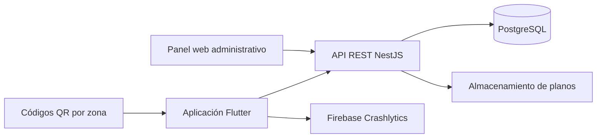

# Arquitectura general

La solución se divide en una aplicación Flutter para ocupantes y responsables, un panel web administrativo, una API REST y una base de datos relacional. Durante Sprint 0, la aplicación trabaja con datos simulados para validar navegación y flujo. La API y el panel se incorporarán de forma incremental.

## Dependencias previstas

- Flutter y Dart para la aplicación móvil.
- NestJS para la API REST.
- PostgreSQL para inmuebles, zonas, rutas, equipos y estados.
- Almacenamiento de objetos para planos e imágenes.
- Firebase App Distribution para versiones alfa y beta.
- Firebase Crashlytics para estabilidad.
- GitHub Actions para integración continua.

La información esencial ya sincronizada deberá poder consultarse con conectividad limitada. Las credenciales y secretos se administrarán fuera del código mediante variables protegidas.

